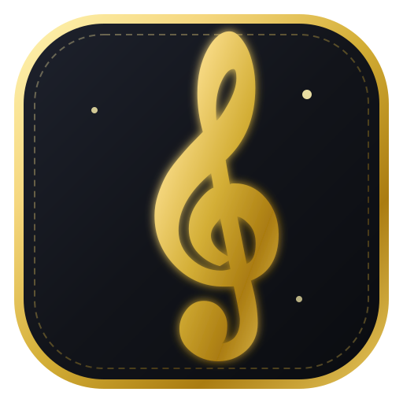

<p align="center">
  
</p>

# 𝄞 Conservatório Musical — Teoria, Partituras & Percepção Auditiva

> Uma plataforma interativa e gamificada para aprender música do zero: leitura de partituras, oitavas, harmonia, treino auditivo e reconhecimento de notas em tempo real via microfone.

---

## 🌟 Visão Geral

O **Conservatório Musical** foi desenvolvido para transformar o aprendizado de teoria e prática musical em uma experiência envolvente, combinando a elegância visual dos conservatórios clássicos com recursos tecnológicos modernos de síntese sonora e processamento de áudio digital (DSP).

---

## 🎹 Principais Recursos

### 1. 📜 Trilha de Aprendizado do Músico (Conservatório)
- **Currículo Progressivo**: Módulos que vão desde os nomes das notas e cifras internacionais até leitura na Clave de Sol, Clave de Fá, valores rítmicos, intervalos e formação de acordes maiores/menores.
- **Teoria Interativa com Partituras Vivas**: Explicações acompanhadas de diagramas de partitura e teclado de piano interativo com reprodução de áudio.
- **Quizzes Práticos**: Exercícios de fixação com múltipla escolha, digitação no piano e identificação auditiva.

### 2. ✨ Partitura Clássica & Animações Douradas
- **Renderização Vetorial Autêntica**: Pauta de 5 linhas com textura de papel pergaminho manuscrito, claves detalhadas, armaduras e compassos.
- **Brilho Dourado e Pulso Radiante**: Anéis de energia luminosa (*halo waves*), partículas de luz (*stardust*) e destaque aureolado nas notas dos exercícios.
- **Suporte a Solfejo & Cifras**: Alternância dinâmica entre notação silábica (Dó, Ré, Mi...) e alfabética (C, D, E...).

### 3. 🎙️ Canto & Afinador de Concerto em Tempo Real
- **Detecção de Pitch por Autocorrelação**: Captação de voz ou instrumento acústico (violão, flauta, violino, piano) diretamente pelo microfone.
- **Desafio Vocal & Instrumental**: O usuário canta ou toca a nota indicada na partitura e o sistema valida a frequência exata em Hertz (Hz) e cents de afinação.
- **Afinador Cromático de Mesa**: Medidor com agulha e display de frequência para afinação rápida.

### 4. 👂 Laboratório de Percepção & Treino Auditivo
- **Modos de Treino**:
  - *Notas Únicas*: Identificação de tons fundamentais.
  - *Comparação de Altura*: Identificar qual das duas notas é mais aguda.
  - *Intervalos*: Segundas, Terças, Quartas, Quintas, Oitavas (com mnêmonicos musicais).
  - *Qualidade de Acordes*: Diferenciação entre Maior, Menor, Aumentado e Diminuto.

### 5. ⚡ Leitor Veloz de Partituras (Arcade 30s)
- **Time-Attack**: Identificação rápida de notas que surgem aleatoriamente na pauta.
- **Sistema de Combos & Recordes**: Multiplicadores de pontos por respostas consecutivas corretas e tabela de recorde pessoal.

### 6. 🏛️ Piano de Cauda Concert Grand & Atelier Musical
- **Teclado de Piano Completo**: Teclas em acabamento marfim e ébano, tira de feltro vermelho aveludado e suporte a atalhos de teclado (`A-K` e `W-U`).
- **Navegação de Oitavas**: Alternância entre Oitavas 2 a 6.
- **Sintetizador Web Audio API Polifônico**: 4 timbres acústicos ajustáveis (Piano de Cauda, Órgão de Tubos, Marimba de Concerto e Sintetizador Analógico).
- **Dicionário de Escalas e Acordes**: Visualização instantânea de Pentatônica, Blues, Menor Harmônica e acordes com inversões.
- **Metrônomo de Precisão**: Marcação de tempo em BPM com compassos de 2/4, 3/4, 4/4 e 6/8.

---

## 🎨 Sistema de Design Clássico

- **Paleta Nobre de Conservatório**: Tons de pergaminho envelhecido (`#FBF8F0`), dourado folha de ouro (`#D4AF37`), ébano polido e veludo rubro.
- **Tipografia**: Pareamento elegante entre *Playfair Display*, *Cormorant Garamond* e *Plus Jakarta Sans*.
- **Gamificação Integrada**: Barra de XP, sequência diária de chamas (*streak*), sistema de corações e medalhas de maestria.

---

## 🛠️ Tecnologias Utilizadas

- **Framework**: React 19 + TypeScript + Vite
- **Estilização**: Tailwind CSS v4 com variáveis customizadas
- **Áudio & DSP**: Web Audio API nativa com geradores de envelope ADSR e algoritmo de autocorrelação temporal para detecção de pitch
- **Ícones**: Lucide React
- **Animações & Efeitos**: Canvas Confetti e Keyframes CSS de halo dourado

---

## 🚀 Como Executar o Projeto

```bash
# 1. Instalar as dependências
npm install

# 2. Iniciar o servidor de desenvolvimento
npm run dev

# 3. Gerar a versão de produção
npm run build
```

---

## 🌐 Publicação no GitHub Pages

O projeto já está configurado com `base: './'` no `vite.config.ts` e inclui um fluxo automatizado do **GitHub Actions**.

### Opção 1: Automático (GitHub Actions) — Recomendado
1. Suba o código para o seu repositório no GitHub (`git push origin main`).
2. No seu repositório no GitHub, vá em **Settings** > **Pages**.
3. Em **Build and deployment** > **Source**, selecione **GitHub Actions**.
4. Pronto! A cada novo `push` para a branch `main` ou `master`, o build e o deploy serão realizados automaticamente.

### Opção 2: Manual via `gh-pages`
```bash
# 1. Gerar os arquivos estáticos na pasta dist
npm run build

# 2. O conteúdo compilado estará pronto em ./dist para publicação
```

---

*Desenvolvido com dedicação à arte e educação musical.* 𝄞
